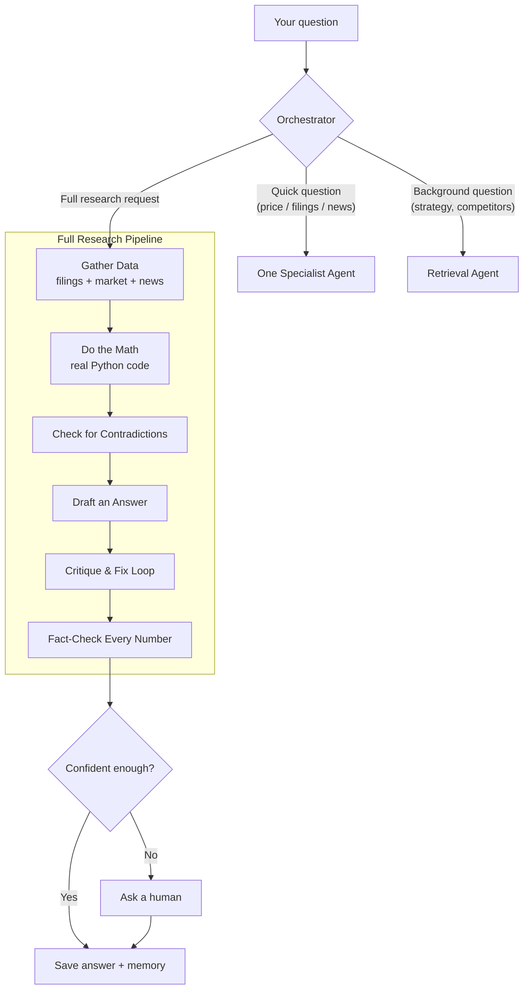

# ARGUS

**A**utonomous **R**easoning & **G**rounded **U**nderstanding **S**ystem


-success)

ARGUS is a team of AI agents that researches a company for you — instead of one AI trying to do everything itself.

You ask a question. It figures out how much work that needs, gathers data, does all the math with real code (not AI guessing), checks its own draft for mistakes, verifies every number against its sources, and — if it isn't confident — pauses and asks a person before answering.

It's built on Google's [Agent Development Kit](https://google.github.io/adk-docs/) (ADK) and runs entirely on the free Gemini API. No cloud bill, no credit card, no paid services.

---

## Table of contents

- [Why it's built this way](#why-its-built-this-way)
- [What it can do](#what-it-can-do)
- [How it works](#how-it-works)
- [Tech stack](#tech-stack)
- [Getting started](#getting-started)
- [Running the tests](#running-the-tests)
- [Evaluation and the ablation experiment](#evaluation-and-the-ablation-experiment)
- [Project structure](#project-structure)
- [A few interesting bugs](#a-few-interesting-bugs)
- [What's built](#whats-built)

## Why it's built this way

Most agent projects show a demo and stop there. This one also tries to answer a harder question: **which parts of the system actually matter, and by how much?**

There's a test suite that scores every answer with plain code — not by asking another AI if the answer "looks right." And there's an experiment that removes pieces of the system (the self-checking loop, the code-execution step) one at a time, to see what actually breaks when they're gone. The results are in [Evaluation and the ablation experiment](#evaluation-and-the-ablation-experiment).

Every real bug found while building this — and how it was found — is written up in [A few interesting bugs](#a-few-interesting-bugs), with the full list in [DEVLOG.md](DEVLOG.md).

## What it can do

- **Picks the right amount of work.** A quick question ("what's the price?") gets a quick answer from one agent. A full research request runs the entire pipeline below. The system decides, not the user.
- **Never lets the AI do math.** Growth rates, margins, and other financial figures are computed by real Python code, not estimated by the model.
- **Checks its own work.** One agent drafts an answer. Another agent tries to find holes in it. This repeats (with a hard limit) until the draft holds up.
- **Fact-checks every number.** Each number in the final answer is checked against the real source data by a simple matching tool, not by asking another AI whether it seems right.
- **Catches contradictions.** If a news headline says one thing but the real financial filing says another for that same year, it gets flagged.
- **Asks a human when unsure.** A low-confidence answer doesn't just get sent anyway. The run pauses and waits for a person to approve, reject, or redirect it.
- **Remembers past answers.** Ask about the same company again later, even in a new chat, and it starts from what it already found.
- **Has safety guardrails.** Blocks investment-advice requests, strips risky language from its own output, and limits how many tool calls one request can make.

## How it works



If the company you ask about isn't found, it tries the closest match once — and always tells you it did, instead of quietly swapping it in.

## Tech stack

| | |
|---|---|
| **Framework** | [Google ADK](https://google.github.io/adk-docs/) 2.5.0 (Python) |
| **Model** | Gemini 3.5 Flash-Lite (free tier) |
| **Math** | Real pandas / numpy code, executed — not AI-estimated |
| **Testing** | pytest, 90 tests, no API calls needed |
| **CI** | GitHub Actions, runs the tests on every push |
| **Data** | Mock financial data for two made-up companies |

## Getting started

```bash
# 1. Set up a virtual environment
python -m venv .venv
.venv/Scripts/python.exe -m pip install -r requirements.txt

# 2. Get a free API key: https://aistudio.google.com -> "Get API key"
# 3. Create argus/.env:
#      GOOGLE_GENAI_USE_VERTEXAI=FALSE
#      GOOGLE_API_KEY=your-key-here

# 4. Run it
.venv/Scripts/adk.exe web --port 8000
```

Open `http://localhost:8000`, pick the `argus` app, and try:

- *"What's Acme Corp's recent stock price trend?"* — a quick, one-agent answer
- *"Give me a full due-diligence analysis of Globex."* — the full pipeline (Globex has a hidden contradiction built into the test data — watch it get caught and called out)

## Running the tests

```bash
.venv/Scripts/python.exe -m pytest tests/ -v
```

90 tests, pure Python, no API calls, runs in a few seconds. Every tool has its logic tested directly; the AI-facing parts are verified by running the app live.

## Evaluation and the ablation experiment

There's a set of 8 test scenarios and 4 scoring checks, all plain deterministic code — never another AI grading the answer.

The more interesting part is what happens when pieces of the system are removed. Three versions were run side by side on the same two test cases (an easy one and a hard one with a real contradiction in it):

| Version | Score (easy case) | Score (hard case) | Extra insight given |
|---|---|---|---|
| **Full system** | 1.0 | 1.0 | growth rate, margins, volatility |
| **No self-checking loop** | 1.0 | 0.97 | same, sometimes more detail |
| **No code execution** | 1.0 | 1.0 | **none** |

**What this shows:** removing the code-execution step did *not* make the AI make numbers up. It was told to say "I don't have that number" instead of guessing, and it did every time. But it also stopped giving any calculated insight at all — no growth rate, no margin trend, nothing. The safety instruction worked; what code execution actually adds isn't accuracy, it's *depth*.

Commands to reproduce both the evaluation and the ablation experiment are in [DEVLOG.md](DEVLOG.md#reproducing-the-results).

## Project structure

```
argus/
  agent.py              entry point (root_agent)
  config.py               model settings, thresholds
  state_keys.py            shared state key names
  agents/                  orchestrator, gather, quant, reconciliation, synthesis,
                             critic, refiner, verifier, retrieval, pipeline
  tools/                   fact-checker, memory, human-approval, memo writer
  callbacks/               safety guardrails
  eval/                    test scoring code + the ablation experiment
data/                      mock company data used for testing
eval/                      the 8 test scenarios
tests/                     90 pytest tests
.github/workflows/         CI setup (runs the tests on every push)
```

## A few interesting bugs

Every one of these was found by actually running the system and reading what happened, not by reading the docs more carefully. The full list, with every stage of the build, is in [DEVLOG.md](DEVLOG.md).

**A rounding rule let a fake number slip through.** The fact-checker allowed a small rounding error — 1% of the real value. That sounds reasonable, until you realize 1% of the year "2025" is about 20. So a made-up "2026" was close enough to pass as real. Fixed by using a small *fixed* allowance instead of a percentage.

**The system couldn't tell its own failures apart from real answers.** When data-gathering failed completely, the AI still wrote a normal-looking report — just a vague one. To another AI reading it, that looked like a finished answer, not an error. Fixed by checking the actual data directly instead of asking the AI to judge its own output.

**A save was silently going nowhere.** A memory-save step was placed in what looked like the right spot. Every test passed, and no errors ever showed up. It still didn't work — that part of the code runs in a temporary, throwaway copy of memory every single time, so the save vanished instantly. Only found because a second test came back with no memory of the first one.

**The test suite had bugs of its own.** The first real test run said everything passed. Looking closer, one fully correct answer scored as barely accurate. It turned out the *scoring code* had six small bugs of its own — like a comma in "$2,850" being read as two separate numbers instead of one. All six were fixed and re-tested before trusting any of the results.

## What's built

The core research pipeline, the self-checking loop, fact-checking and safety guardrails, smart routing with retries and background search, memory, human approval, saved reports, and the full evaluation and ablation harness described above.

See [DEVLOG.md](DEVLOG.md) for the complete build history.
