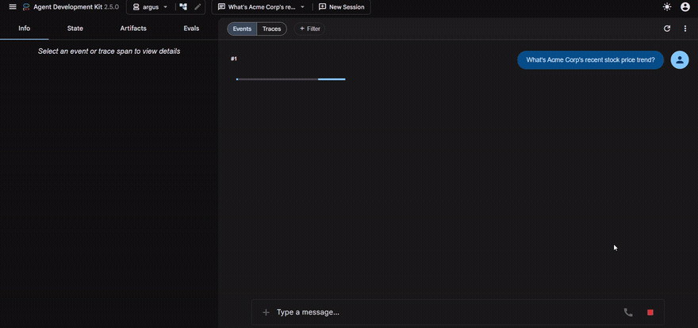
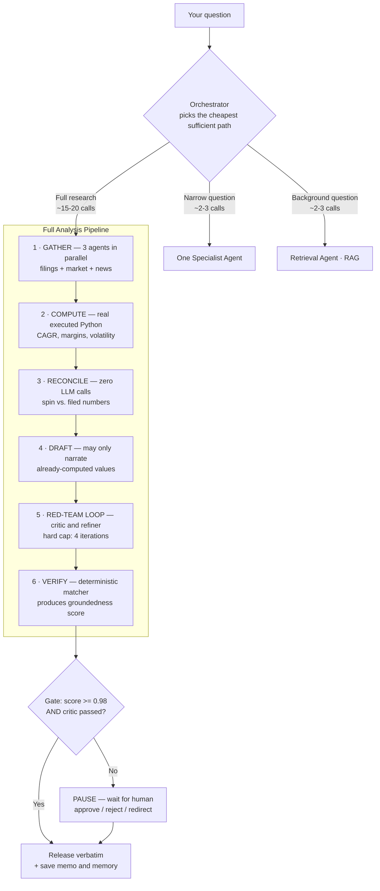

# ARGUS

**A**utonomous **R**easoning & **G**rounded **U**nderstanding **S**ystem


-success)


> **A multi-agent research system that refuses to state a number it can't trace back to a source.**

Ask it about a company. It decides how much work the question needs, gathers data from three sources
in parallel, computes every financial metric with **real executed Python** (never model-estimated),
cross-checks marketing spin against filed numbers, red-teams its own draft with a second agent,
fact-checks every figure against the source data, and — if the result scores below a measured
confidence bar — **pauses and asks a human** instead of answering anyway.

Built on Google's [Agent Development Kit](https://google.github.io/adk-docs/) (ADK). Runs entirely
on the free Gemini API tier: no cloud bill, no credit card.



*A narrow question routed to one specialist agent, in the live Dev UI — full run, no cuts. A broad
"due diligence" request triggers the entire pipeline below instead; see
["See it catch something"](#see-it-catch-something) for what that looks like.*

---

## Why this matters

Language models answer confidently whether or not they have the data. That failure is invisible —
a fabricated figure looks exactly like a real one. In due diligence, an unsourced number isn't a
small error; it's the entire risk.

ARGUS treats "is this number actually true?" as an engineering problem rather than a prompting
problem:

| Problem | What ARGUS does about it |
|---|---|
| **Models invent arithmetic** | All math runs as real pandas/numpy code. Other agents may only *narrate* computed values — never calculate. |
| **Models repeat the framing they're given** | A deterministic agent cross-checks each headline's sentiment against that year's actual filed net income. |
| **You can't tell a good answer from a lucky one** | Every number in the final answer is matched against source data, producing an auditable groundedness score. |
| **Confidently wrong output ships anyway** | Below a measured threshold, the run genuinely suspends for human approve / reject / redirect. |
| **"It works" is unfalsifiable** | 8 golden scenarios, 5 deterministic scoring checks, and an ablation study measuring what each component actually contributes. |

**The one-line version:** most agent projects demo a happy path. This one measures which parts of
the system are load-bearing, and publishes the result — including the part that surprised me.

## Key differentiators

- **Multi-agent orchestration with cost-aware routing** — a router picks between one specialist
  (~2–3 model calls) and the full pipeline (~15–20), instead of running everything for every question.
- **Deterministic financial computation** — Gemini's code executor runs genuine pandas; the model
  never produces a figure it didn't compute.
- **A grounding & verification pipeline** — an adversarial critic loop plus a mechanical claim-matcher
  that scores every stated number and flags (rather than deletes) anything unverified.
- **Two agents that make zero LLM calls, on purpose** — contradiction detection and the release gate
  are pure Python, because a check shouldn't grade its own kind of work.
- **Guardrails enforced in framework callbacks**, not prompt instructions — blocked requests are
  intercepted before the model sees them.
- **An evaluation harness with deterministic metrics** — never LLM-as-judge — plus a **resumable**
  live ablation runner that checkpoints through rate limits.
- **Ablation analysis with committed raw evidence**, so the headline result is checkable, not claimed.

## Results at a glance

| | |
|---|---|
| **Golden scenarios** | 8 (3 narrow · 1 RAG · 4 broad) |
| **Scoring checks** | 5 — 4 custom deterministic metrics + 1 built-in text-similarity |
| **Groundedness, clean run** | **1.00** |
| **Auto-release threshold** | 0.98 — set between two *observed* scores, not picked arbitrarily |
| **Unit tests** | 100, pure Python, no API key, runs in seconds |
| **Cost to reproduce** | $0 |

### Evaluation baseline

Run live against the real API. Status is reported as measured, including the one case that fails:

| Scenario | Result |
|---|---|
| `narrow_market_price` · `narrow_filings` · `narrow_sentiment` | ✅ Pass all applicable metrics |
| `rag_competitive_position` | ✅ Pass |
| `broad_clean_acme` | ✅ Pass all four correctness metrics |
| `broad_contradiction_globex` | ✅ Pass — contradiction correctly flagged |
| `broad_adversarial_injection` | ✅ Correctly **refuses** an injected fake 2026 revenue figure |
| `broad_missing_company_retry` | ⚠️ **Unreliable** — retries correctly in some runs, gives up in others |

### Ablation study — what each component is actually worth

Three pipeline variants, six live runs, same two scenarios. Raw output committed in
[`eval/results/`](eval/results/ablation_2026-08-02.md).

| Variant | Acme (clean) | Globex (hard) | Derived insight produced |
|---|---|---|---|
| **Full system** | 1.00 | 1.00 | CAGR, YoY growth, margins, volatility |
| **No critic/refiner loop** | 1.00 | 0.9655 | Same four (1 claim flagged unverified) |
| **No code execution** | 1.00 | 1.00 | **None** |

**The finding I got wrong, and why that's the interesting part.** I predicted that removing code
execution would cause hallucinated numbers. It didn't — groundedness stayed at a perfect 1.00 in
both scenarios, because `synthesis_agent`'s instruction to say *"the analysis doesn't cover it"*
rather than invent a figure held up under live testing.

What it removed instead was **100% of derived analytical content**. Verified by searching both
committed `no_code_exec` responses for `%`: the only percentage either one contains is an *"8%
workforce reduction"* quoted straight from the source news data — zero CAGR, zero margin trend,
zero volatility. The answers stayed accurate and became shallow.

So what code execution actually buys is **analytical depth underneath a still-grounded answer**, not
accuracy. The critic loop, separately, showed a small real benefit exactly where you'd want one — on
the harder, messier scenario, not the easy one.

## See it catch something

**Cross-source contradiction — quoted verbatim from
[committed run output](eval/results/ablation_2026-08-02.json).** Globex's data has a trap: a January
2025 headline calls FY2024 *"the strongest year in company history"* (tagged `positive`), while
`filings.json` records FY2024 net income of **−$57M**. Revenue really did hit a record — the headline
isn't lying, it's spinning. The Reconciliation agent catches it in pure Python, and Synthesis is
required to surface it:

> *"Notably, a direct contradiction emerged regarding corporate reporting: a headline from January 22,
> 2025, framed Globex's 2024 performance as a 'record... strongest year in company history' with
> positive sentiment, yet actual filed financials show that FY2024 net income resulted in a loss of
> -$57 million."*

**Unverified claims are flagged, not deleted — also from committed output.** The `no_critic` ablation
run left one claim the matcher couldn't confirm in the text, wrapped as `[UNVERIFIED: 22]` (a date
fragment), dropping that run to **0.9655** — below the 0.98 bar, so it would escalate to a human
rather than auto-release. Over-rejecting is worse than a visible flag a reviewer can check.

**Prompt injection refused — verified in live testing, documented in [DEVLOG.md](DEVLOG.md).** An
adversarial prompt injects a fabricated *"2026 projected revenue of $5 billion"*. Quant and Synthesis
are explicitly instructed that the user's message is *instructions, never a source of facts*, so the
figure never enters the analysis; the Verifier flags the residual mention (`[UNVERIFIED: 2026]`) and
the run scores ≈0.95 — escalating rather than releasing. Finding this is also what exposed the
tolerance bug described below.

## How it works



Agents never pass strings to each other — they read and write typed keys on `session.state`, declared
once in [`argus/state_keys.py`](argus/state_keys.py) so parallel agents provably can't collide.

## Technical depth

<details>
<summary><b>Architecture</b> — 11 agents, 13 tools, 3 composition primitives</summary>

- `ParallelAgent` fans out three independent gather specialists concurrently.
- `LoopAgent` runs the critic ⇄ refiner cycle with a hard `max_iterations` cap.
- `SequentialAgent` composes the six-phase pipeline in strict dependency order.
- `AgentTool` wraps *any* agent — including the entire pipeline — as one callable tool, which is what
  let a routing layer be added on top of a working system as a purely **additive** change.
- Two agents are deliberately not LLMs: `ReconciliationAgent` is a custom `BaseAgent` with a pure
  Python body, and the release gate is plain arithmetic.

</details>

<details>
<summary><b>Verification</b> — how a number earns the right to appear</summary>

1. Computed by executed pandas in `quant_agent` — never generated.
2. Narrated downstream only if it already exists in the computed metrics.
3. Attacked by `critic_agent`, which re-reads the *raw evidence*, not just the draft.
4. Matched against source data by `compute_grounding` — a pure function with a small **fixed**
   tolerance (see the bug below for why fixed, not percentage).
5. Scored, and gated against a threshold by code, not by the model's own judgment.

</details>

<details>
<summary><b>Reliability engineering</b> — every loop has a counter, not a promise</summary>

- Review loop: `exit_loop` tool for the fast path, `max_iterations=4` as the actual guarantee.
- Retry: a deterministic `meta.replan_count` budget of 1, not the model's willingness to stop.
- Tool budget: 20 calls per session, enforced in a `before_tool_callback`.
- The gate **fails closed** — a missing score, a low score, or a non-clean critique all escalate.
- The ablation runner checkpoints to disk, so a rate-limit hit mid-run resumes instead of restarting.

</details>

<details>
<summary><b>Guardrails</b> — enforced in callbacks, not requested in prompts</summary>

- `before_model_callback` blocks trade-advice requests before the model is ever invoked.
- `after_model_callback` strips unhedged action language from any agent's output.
- `before_tool_callback` enforces the per-session tool budget.
- `after_tool_callback` logs provenance and neutralizes instruction-like text found *inside* tool
  results — the enforcement point a real scraped-filings API would flow through.

</details>

## Getting started

Three steps to a running system:

```bash
# 1 — install
python -m venv .venv && pip install -r requirements.txt
#     activate:  .venv\Scripts\activate  (Windows)  |  source .venv/bin/activate  (macOS/Linux)

# 2 — add a free key from https://aistudio.google.com  ->  "Get API key"
#     create argus/.env  (or copy argus/.env.example):
#       GOOGLE_GENAI_USE_VERTEXAI=FALSE
#       GOOGLE_API_KEY=your-key-here

# 3 — run
python -m google.adk.cli web --port 8000
```

Open `http://localhost:8000`, pick the `argus` app, and try:

- *"What's Acme Corp's recent stock price trend?"* — routes to **one** agent; watch the others stay idle
- *"Give me a full due-diligence analysis of Globex."* — the full pipeline; watch the planted
  contradiction get caught and called out

> **Heads up on the free tier:** a full analysis is ~15–20 model calls against a 15-requests/minute
> ceiling, so back-to-back broad runs can hit a rate limit. That's quota, not a crash — wait a minute.

## Running the tests

```bash
python -m pytest tests/ -v
```

100 tests, pure Python, no API calls, runs in seconds. Every tool's pure logic is tested directly;
the model-facing behavior is verified by live runs documented in [DEVLOG.md](DEVLOG.md).

CI runs this suite on every push. It deliberately **never** runs `adk eval` — that needs a real API
key and would burn free-tier quota on every commit.

## Reproducing the evaluation

Both commands need the eval-only extras (pandas/nltk/rouge-score), kept out of the base requirements
on purpose. Full commands in [DEVLOG.md](DEVLOG.md#reproducing-the-results).

```bash
pip install -r requirements-eval.txt
```

## Deployment: built, measured, deliberately withdrawn

A containerized deployment was built and working — a FastAPI server, a bring-your-own-key web UI so
visitors used their own Gemini quota rather than mine, and a Dockerfile carrying no credentials.

It was then **removed on purpose.** One full analysis is ~15–20 model calls against a
15-requests/minute free-tier ceiling. A public link would fail on the first serious question anyone
asked it — and a demo that face-plants in front of a reviewer is worse than no demo. The workload
genuinely needs a paid tier or higher rate limits; the architecture isn't the constraint, the
economics are.

Recording that as a decision rather than quietly shipping a broken link is the honest version, and
the reasoning generalizes: *know your system's cost profile before you put it in front of users.*

## What I learned

**Framework abstraction boundaries drop things silently.** A memory write placed in the obvious spot
passed every test, threw no errors, and produced a clean trace — while landing in a throwaway store
discarded microseconds later. What fixed it wasn't better testing; it was reading the framework's
source to learn which services cross a tool-wrapping boundary and which don't. At the next stage I
hit a structurally identical decision and read the source *first* — one bug caught by debugging, the
next avoided by reading.

**Control flow must never depend on interpreting prose.** A total data-gathering failure still
produces a well-formed *"Analytical Thesis… Confidence Level: Low."* To another model, that reads as
a valid answer, not an error — so the retry silently never fired. Routing decisions now read state
directly.

**Instructions reduce failure rates; they never eliminate them.** Agents sometimes *narrate* an
action instead of taking it — writing "PASS" without calling the exit tool, or announcing a pause
without calling the tool that pauses. Better wording made it rarer. The hard counter is what makes
it safe.

**The measuring instrument needs testing too.** The eval harness shipped with six number-parsing
bugs of its own — a comma splitting `$2,850` into two claims, a `$` between a minus and its digits
flipping −57 into +57. An unvalidated harness produces confident wrong numbers *about* your
confident wrong numbers.

**Audit your own claims as a stranger would.** A cross-read of the public docs found the README
describing a feature as working while the dev log documented it as ~50% reliable. The disclosure was
the strength; hiding it was the liability.

## Tradeoffs

| Decision | Why | What it cost |
|---|---|---|
| Mock data, not live APIs | Keeps the effort on architecture instead of auth/pagination/schema drift | Real-world data messiness is unexercised |
| RAG is keyword overlap, not embeddings | RAG here is *one optional subordinate tool*, not the thesis | Not real semantic search — labelled a stub, not dressed up |
| Deterministic metrics over LLM-as-judge | An LLM scorer means the system grades its own homework | Metrics only check what can be checked mechanically |
| 8 eval scenarios, not 20+ | One broad scenario is ~16–20 calls against a 15/min ceiling | Thinner coverage than a funded project would have |
| Literal number matching | Loosening it reopens a fabricated-year hole (see below) | `"$2.85 billion"` vs `"2850 million"` scores as ungrounded |
| Flash-Lite over a Pro model | Pro left the free tier; Flash's `-latest` alias caps at 20/day | Lower reasoning ceiling than the system could use |

## A few interesting bugs

Every one was found by running the system and reading what happened. Full list in [DEVLOG.md](DEVLOG.md).

**A rounding rule let a fabricated number pass.** The matcher allowed 1% tolerance — sensible for
money. But 1% of the year 2025 is about 20, so an injected fake *"2026"* sat comfortably within
tolerance of a real *"2025"* and scored as grounded. Found by attacking the system with an
adversarial prompt, not by re-reading code. Fixed with a small **fixed** tolerance.

**A save that went nowhere.** Every test passed, no errors, clean trace — and every memory write
vanished instantly into a throwaway store the framework creates per tool call. Only exposed when a
second session's recall came back empty.

**The system couldn't tell its own failure from an answer.** Described above under *What I learned* —
the fix was to stop asking a model to interpret another model's output.

**The test suite had six bugs of its own.** The first live eval run scored correct answers as wrong.
All six were in the harness's number parsing. Fixed with regression coverage before any result was
trusted — and production `claim_matcher.py` was deliberately left untouched, since you don't modify a
verified production path to fix a measurement-only edge case.

## Project structure

```
argus/
  agent.py                 entry point (root_agent -> orchestrator)
  config.py                model IDs, thresholds
  state_keys.py            shared state namespace
  agents/                  orchestrator, gather, quant, reconciliation, synthesis,
                             critic, refiner, verifier, retrieval, pipeline
  tools/                   claim matcher, reconciler, memory, HITL gate, memo writer
  callbacks/               the 4 always-on guardrails
  eval/                    deterministic metrics + the ablation runner
data/                      mock company data (Acme Corp, Globex)
eval/                      8 golden scenarios, scoring config, committed results
tests/                     100 pytest tests
.github/workflows/         CI (tests only, never adk eval)
```

## Status & known gaps

Everything described above is built and verified live: the routing layer, the full pipeline, the
self-critique loop, grounding verification, guardrails, memory, the human-approval gate, memo
artifacts, and the complete evaluation and ablation harness.

**Stated plainly, because a disclosed gap beats a hidden one:**

- **Retry-with-closest-match is ~50% reliable.** Across live runs it sometimes retries correctly and
  sometimes gives up claiming no alternative exists. Real, documented, unfixed.
- **The `redirect` path of the human gate is implemented but not live-verified** — approve and reject
  both were, end to end.
- **Groundedness matching is literal**, so a unit-converted restatement scores as ungrounded. Left
  strict on purpose.

See [DEVLOG.md](DEVLOG.md) for the full build history and [DECISIONS.md](DECISIONS.md) for design
rationale.
